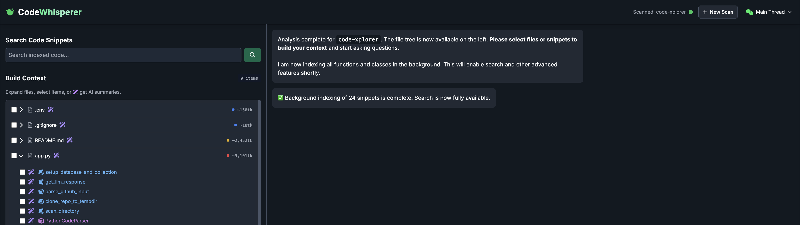

# Trustworthy AI Code Analysis



We've all been there: starting a new job or joining a new team, you're faced with a sprawling, unfamiliar codebase. The `README` is a month out of date, and your only guide is the `git blame` history. Where do you even begin? The traditional approach involves hours of painstaking detective work, grepping for a `main` function and slowly piecing together the puzzle.

What if you could have an expert AI architect sit with you, point out the critical files, and then answer your questions with complete transparency? And what if this entire powerful experience was delivered in a **single, self-contained Python script** you can run locally against any codebase?

That’s not a future concept; it’s the reality of a complete, local-first web tool I built called **Code Explorer AI**. It’s designed to transform AI from an opaque black box into a trustworthy, transparent partner for developers, all from a single `app.py` file.
  
**Code Explorer AI** brings these ideas to life in a local, self-contained way. You run `app.py` on your machine, point it to a directory or a GitHub repo, and it performs a multi-stage analysis of every file. It extracts structural and conceptual information—finding classes, functions, imports, and code “action tags” (like `data-storage` or `network-request`). An **LLM** (Large Language Model) then creates specialized JSON “metadata” for each snippet, distilling the purpose, key entities, and a plain-English summary.  
  
Everything happens locally, or via your own managed resources (like your own MongoDB cluster). That means your code never leaves your environment unless *you* explicitly want it to. The end result is a hybrid search and Q&A web interface that’s accessible in your browser. It fuses:  
  
1. **Full-Text Search** – Perfect for exact keyword matches.    
2. **Vector Similarity Search** – Powered by specialized code embeddings from Voyage AI to find conceptually similar snippets even if the words don’t match exactly.  
  
---  
  
### Under the Hood: How It All Works  
  
#### Phase 1: Scanning & Parsing  
  
When you start a Code Explorer AI session, it recursively scans your repository. It ignores known irrelevant directories and file types (like `node_modules`, `.git`, images, etc.). For each valid code file:  
  
1. **Structural Analysis**: By using language-specific parsing techniques (like Python’s `ast` module), the system finds your functions, classes, and even JavaScript/TypeScript interfaces or arrow functions.  
2. **Action Tagging**: A robust set of regex patterns checks for specific lines of code. For example, if you import `pymongo` or see a snippet with `db.collection(...)`, it’s tagged as `data-storage`. If you use `requests` or `axios`, it’s tagged as `network-request`. This helps you quickly locate specialized areas like database queries, HTTP endpoints, and more.  
  
```python  
# Example Python snippet (database.py)  
  
import pymongo  
  
def get_user(db_client, user_id):  
    """Fetches a user from the users collection."""  
    users_collection = db_client.db.users  
    return users_collection.find_one({"_id": user_id})  
```  
  
In this snippet:  
- It identifies `get_user` as a function with the purpose of “user data retrieval.”  
- It sees `import pymongo` and tags the snippet (and file) as `data-storage`.  
- It also tracks the lines where the function starts and ends, so you can do targeted extractions.  
  
#### Phase 2: AI-Powered Indexing  
  
Once the system has your raw code structure, it calls a specialized LLM (notice in the attached code, it references Azure OpenAI, but you could adapt it to other LLM providers). The LLM acts like an expert dev who inspects each snippet and returns a structured JSON object:  
  
```json  
{  
  "summary": "This Python function retrieves a single user document from a MongoDB collection. It takes a database client and a user_id as input and uses the find_one method to query the 'users' collection.",  
  "description": "A Python function using pymongo to find a user by their ID in a MongoDB database.",  
  "purpose": "User data retrieval",  
  "tags": ["database-query", "mongodb", "data-retrieval"],  
  "key_entities": ["get_user", "db_client", "users_collection", "find_one"]  
}  
```  
  
Simultaneously, each snippet is embedded into a **vector** using Voyage AI’s `voyage-code-2` model. This specialized embedding captures the snippet’s meaning at a deeper level than a general-purpose text model could, making your searches far more relevant.  
  
---  
  
### Search: The $rankFusion Superpower  
  
When you run a search query, Code Explorer AI uses MongoDB 8.1’s `$rankFusion` operator to perform a **hybrid search**. It simultaneously:  
  
- **Full-Text Searches** for literal keyword matches in code or summaries.    
- **Vector Searches** for conceptually similar snippets.    
  
Then it merges the two result sets and ranks them using **Reciprocal Rank Fusion (RRF)**. This means if you type “find user document with pymongo,” you’ll get `get_user(...)` as the top result—even if your snippet uses slightly different words like “retrieve a user.”  
  
The real magic? All of this lives in your MongoDB cluster, not across multiple external systems. You don’t need separate services for full-text, vector search, or complicated merging logic. `$rankFusion` does it all in a single aggregation pipeline.  
  
---  
  
### Why Specialized Code Embeddings?  
  
General text models (like standard GPT embeddings) often miss the deeper structure of code. They might see `def get_user(token):` and the comment “Retrieve a user with a token” as basically the same. That’s good for simple text search, but code is more nuanced.  
  
A specialized code embedding model knows:  
- Common syntax patterns (`def`, classes, imports, etc.).  
- Idiomatic usage: a method named `has_permission()` likely returns a boolean.  
- Typical variable naming conventions (e.g., `user_id` relates to user data, not a random integer).  
  
So when you search for “database connection logic,” it picks up on code that references `pymongo` or `connect_to_db` or even `sqlalchemy` if that’s relevant, even if none of those words appear exactly as “database connection logic.”  

----

## Appendix: How Code is Understood and Indexed

This system uses a multi-stage pipeline to transform raw source code into a smart, searchable index. The process can be broken down into two main phases: **Scanning & Parsing** and **AI-Powered Indexing**.

-----

### Phase 1: Scanning and Parsing

This initial phase is about reading the code and understanding its basic structure and dependencies.

1.  **File Ingestion**: The system scans the target repository, ignoring irrelevant directories (like `.git` or `node_modules`) and file types (like images or logs).

2.  **Structural Analysis**: Each source code file is analyzed to identify its core components. The system detects every **function** and **class**, extracts any **imported libraries**, and assigns preliminary **action tags** (e.g., `data-storage`, `network-request`).

#### **Example 1: Basic Code Parsing**

Consider this simple Python file, `database.py`:

```python
# database.py
import pymongo

def get_user(db_client, user_id):
    """Fetches a user from the users collection."""
    users_collection = db_client.db.users
    return users_collection.find_one({"_id": user_id})
```

From this file, the parsing pipeline extracts:

  * **Snippet**: A function named `get_user`.
  * **Import**: The `pymongo` library.
  * **Static Tag**: Because `pymongo` is imported, the file and the `get_user` function are tagged with **`data-storage`**.

-----

### Phase 2: AI-Powered Indexing

Once a snippet like the `get_user` function has been identified, it's sent for deeper analysis and indexing.

1.  **AI Metadata Generation**: The code snippet is sent to a Large Language Model (LLM). The LLM acts like an expert developer, analyzing the code's purpose and returning a structured JSON object with a human-readable summary and other metadata.

#### **Example 2: LLM Metadata Output**

For the `get_user` function, the LLM would return something like this:

```json
{
  "summary": "This Python function retrieves a single user document from a MongoDB collection. It takes a database client and a user_id as input and uses the find_one method to query the 'users' collection.",
  "description": "A Python function using pymongo to find a user by their ID in a MongoDB database.",
  "purpose": "User data retrieval",
  "tags": ["database-query", "mongodb", "data-retrieval"],
  "key_entities": ["get_user", "db_client", "users_collection", "find_one"]
}
```

2.  **Embedding Creation (Vectorization)**: Simultaneously, the same code snippet is converted into a numerical "embedding." An embedding is a vector of numbers that serves as a **"meaning fingerprint."**  Code snippets with similar functionality will have mathematically similar fingerprints, regardless of the exact variable or function names used.

#### **Example 3: Conceptual Similarity**

Vectorization allows the system to understand *intent*. Even though the following phrases use different words, their embeddings would be very close because their meaning is the same.

  * Our code snippet: `def get_user(...)`
  * A search query: "How do I find a person in the database?"
  * Another function: `const fetchCustomerById = ...`

This is the key to finding conceptually related code, not just literal text matches.

-----

### How Search Uses This Index

The indexed data powers a sophisticated two-pronged search mechanism, blended by MongoDB's `$rankFusion`.

1.  **Full-Text Search**: This is a traditional keyword search. It's perfect for finding exact matches.
2.  **Vector Search**: This search compares the "meaning fingerprint" of your query against the fingerprints of all indexed code snippets to find the closest conceptual matches.

#### **Example 4: A Combined Search Query**

Imagine you search for: "**find user document with pymongo**"

  * **Full-Text Search** finds snippets that contain the literal words "user," "document," and "pymongo."
  * **Vector Search** converts your query's meaning into an embedding and finds code with a similar purpose, like the `get_user` function.

`$rankFusion` looks at both sets of results and boosts the ranking of items that appear in both. Since the `get_user` function is a strong match for both its meaning (Vector Search) and its keywords (Full-Text Search), it is presented as the top result.

---

## Appendix: The Power of Specialized Code Embeddings with Voyage AI

To build a search engine that truly understands source code, you can't treat code like a plain English paragraph. While general-purpose text embedding models are great at grasping the meaning of sentences, they often fail to capture the unique nuances of a programming language. This is where a specialized model like **Voyage AI's `voyage-code-2`** provides a critical advantage.

Think of it this way: a general text model might see the code `def authenticate_user(token):` and the English sentence "A function to authenticate a user with a token" as very similar. That's a good start. However, it struggles with the deeper, structural meaning of code.

A specialized code embedding model is trained specifically on vast amounts of source code across many languages. This allows it to understand concepts that a general model misses:
* **Syntax and Structure:** It learns that `def` in Python or `function` in JavaScript signifies a reusable block of logic. It understands the relationship between function names, parameters (`token`), and the code's intent.
* **Idiomatic Patterns:** It recognizes common programming patterns. For example, it knows that a function named `is_valid()` or `has_permission()` is likely to return a boolean value, which is conceptually different from a function like `get_user_data()` that retrieves information.
* **Variable Naming Conventions:** It can infer meaning from variable names like `user_id`, `db_connection`, or `req`, connecting them to their typical roles within an application.

The practical benefit is a massive leap in search relevance. When a developer searches for "database connection logic," `voyage-code-2` can generate an embedding that is conceptually closer to a code block that imports `pymongo` and defines a `connect_to_db` function, even if the exact words "connection logic" don't appear. A general model, in contrast, might be distracted by comments or unrelated text files that happen to contain those keywords.

For a tool designed to help developers navigate a complex codebase, using a fine-tuned code embedding model is not a luxury—it is the core component that ensures the search results are not just textually similar, but **functionally relevant**.

---

## Appendix: Why `$rankFusion` in MongoDB 8.1 is a Game-Changer

The introduction of the `$rankFusion` aggregation stage in **MongoDB 8.1** represents a fundamental shift in how developers can build sophisticated AI-powered applications. It moves hybrid search from a complex, multi-system architectural challenge into a simple, powerful, and native database feature.

### The Old Way: The Integration Treadmill

Before `$rankFusion`, implementing hybrid search meant running on an "Integration Treadmill." Your architecture was a fragile assembly of disparate parts:
1.  **Multiple Systems:** You needed an operational database (like MongoDB), a separate full-text search engine (like Elasticsearch), AND a separate vector database (like Pinecone or Weaviate).
2.  **Multiple Queries:** Your application had to send the user's query to at least two different APIs and wait for two sets of results.
3.  **Complex Application Logic:** The most difficult part happened in your application code. You had to pull both result lists, attempt to normalize two completely different and incompatible scoring systems, and write brittle, custom code to merge them into a single coherent list.

This approach is slow, expensive, and creates significant technical debt. The merge logic in your application is a major point of failure, and you are perpetually at risk of breaking changes from multiple third-party APIs.

### The Atlas Way: One Platform, One Operator

`$rankFusion` eliminates this complexity by absorbing the entire workload into a single, optimized database operation. The benefits are immediate and transformative:
* **Radical Simplicity:** The dozens or hundreds of lines of merge-and-rank code in your application disappear. They are replaced by a single, declarative aggregation pipeline in MongoDB. Your architecture is simplified to just your application and Atlas.
* **Massive Performance Gains:** The fusion logic runs natively inside the database engine, right next to the data. This avoids the high network latency of making multiple API calls and transferring large result sets back to your application for client-side processing.
* **Superior Relevance:** The operator uses a state-of-the-art **Reciprocal Rank Fusion (RRF)** algorithm, which is proven to be more effective at combining search results than ad-hoc score normalization. You get better search results with less effort.

Upgrading to **MongoDB 8.1** is more than just a version bump; it is a strategic decision to get off the Integration Treadmill. It allows you to build faster, more relevant, and more resilient AI features by leveraging the power of a unified platform. It's the difference between building a fragile machine out of mismatched parts and using a single, powerful, purpose-built engine. For any team serious about building modern applications, the move to version 8.1 should be a top priority.

